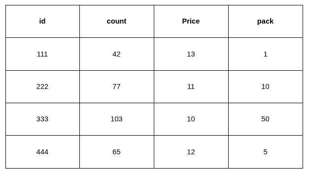
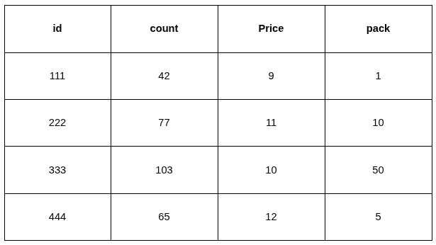
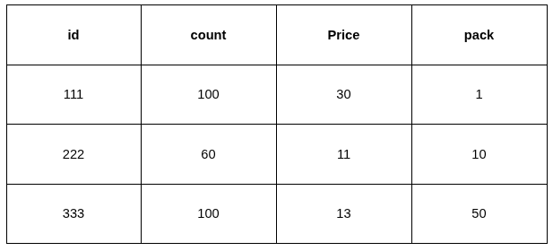

## Алгоритмическая задача
### Дано: 
двумерный массив, суть – «прайс-лист» товаров (одинаковых) от разных поставщиков. Каждая строка содержит поля:

- `id` – идентификатор предложения, уникальный в пределах таблицы (int)
- `count` – количество товара на складе (int, >0)
- `price` – цена товара (float, >0)
- `pack` – «кратность» товара (int, >0). Означает, что поставщик по данному предложению может продать товар только партиями, кратными значению pack.

Исходный массив не отсортирован.
Также дано `число N` (int) – «потребность», т.е. количество единиц товара, которые необходимо закупить.

**Ограничения на входные данные:**
- Максимальное количество строк в прайс-листе – 1000.
- Максимальное `значение N` – 10000.
- Максимальное значение для параметра `pack` – 500.
- Максимальное количество «вариаций» (т.е. различных значений) параметра pack в пределах одной таблицы – 20.

### Задача:
Определить оптимальный (самый дешевый по цене) «план» закупки, т.е. какие строки и в каком количестве необходимо выбрать для закупки, чтобы итоговая сумма была минимальной.

Задача может не иметь решения. Например, в случае, когда число N больше, чем сумма count по всей таблице. Или, к примеру, все строки прайса имеют параметр pack=10, а число N=13. В этих случаях на выходе должен быть «пустой» набор. 

В случае, когда «план» закупки можно составить, на выходе должен быть массив элементов, содержащих поля `{id, qty}`, где `id` – идентификатор предложения из исходного массива, `qty` – то количество, которое необходимо у него закупить.

Поле `pack` ключевое в данной задаче и очень сильно влияет на сложность.

### Пример:
Исходные данные в виде таблицы:
N=76
Ответ: [[111,1],[222,20],[333,50],[444,5]].

Сортировка элементов внутри массива-ответа не имеет значения.

### Другие примеры:

Исходные данные: 
N=76
Ответ:  [[111,26],[333,50]]

Исходные данные: 
N=76
Ответ: [[111,6],[222,20],[333,50]]
 
